# Análise de dados Exploratória (EDA) - Visão geral

Antes de começar, precisamos conhecer cada uma das features do dataset:
- Dados numéricos: `Age`,`Family member count`, `Account age`, `Income`, `Employment length`
- Dados categóricos: `Has a mobile phone`, `Has a work phone`, `Has a phone`, `Has a car`, `Has a property`, `Has an email`, `Gender`, `Employment status`, `Marital status`, `Dwelling`, `Job title`

As features `Has a car` e `Has a property` foram mapeadas em {0,1} ao invés de {Y,N}, enquanto as colunas `Age`, `Account age` e `Employment length` precisaram ser convertidas para anos. Por fim, os resultados `NaN` presentes na feature `Job title` foram renomeados para `no title`, pois esta ausencia não implica na remoção dos dados.

## Feature alvo: `Is high risk`

Os dados exibem uma enorme tendencia aos casos de *sem risco*. Este distribuição desigual complica a predição de padrões de alto risco no caso de Machine Learning.

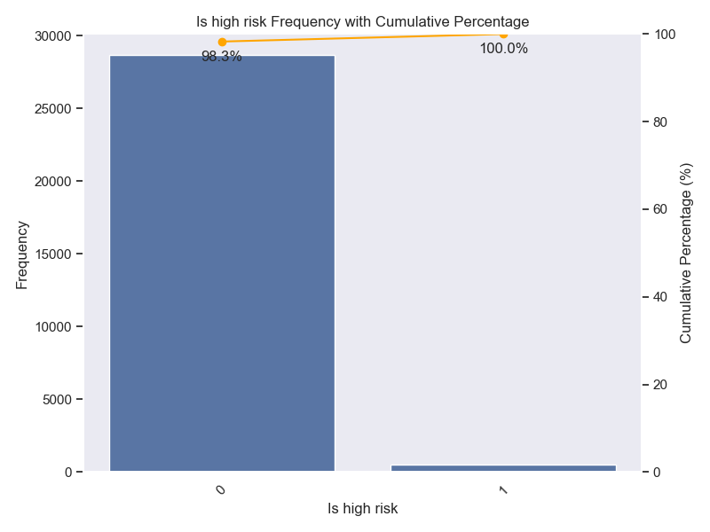

## Dados categóricos: distribuição

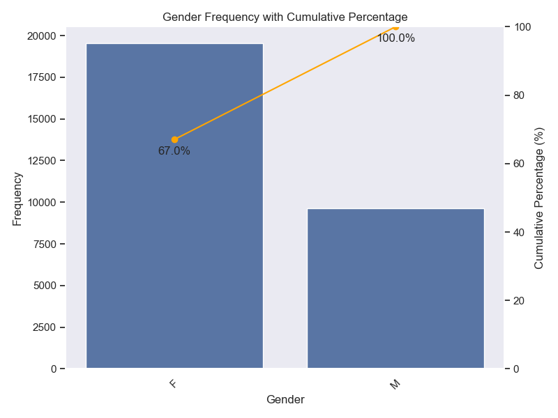
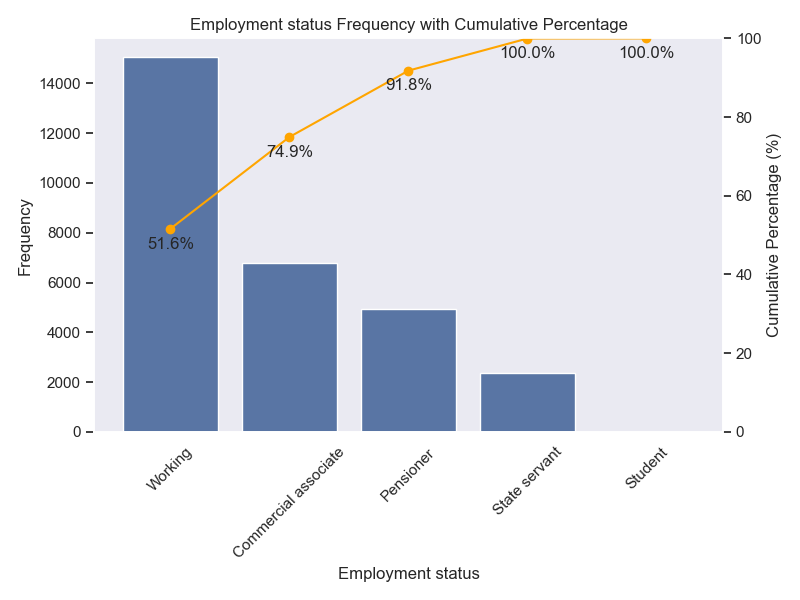
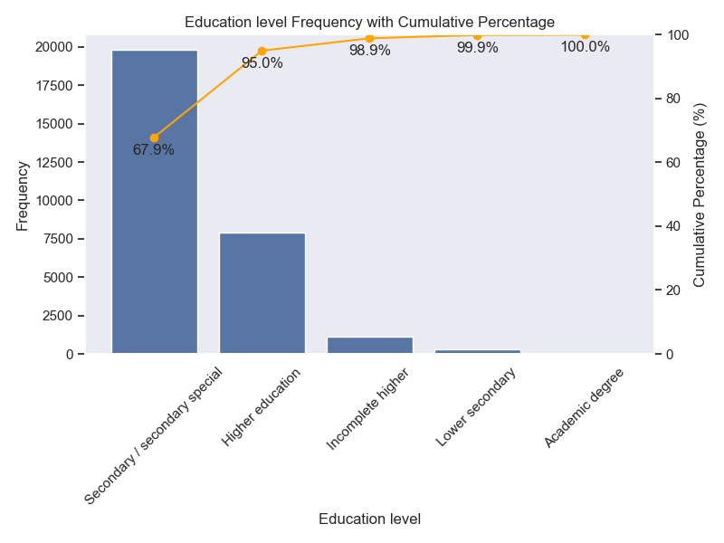
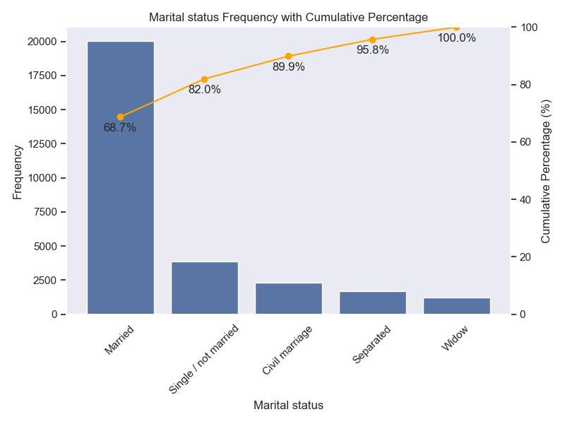
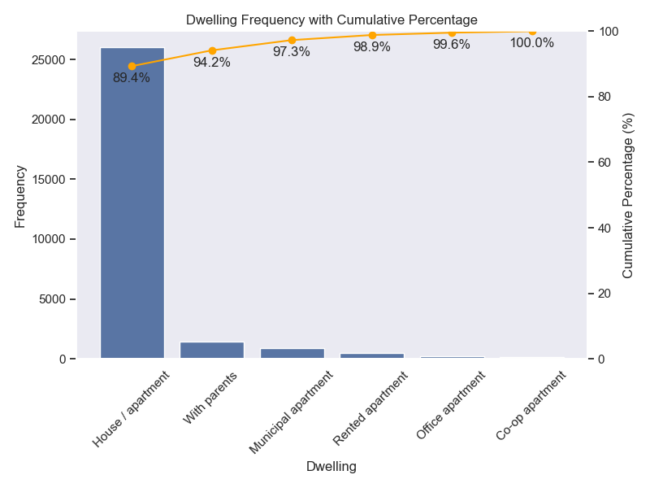
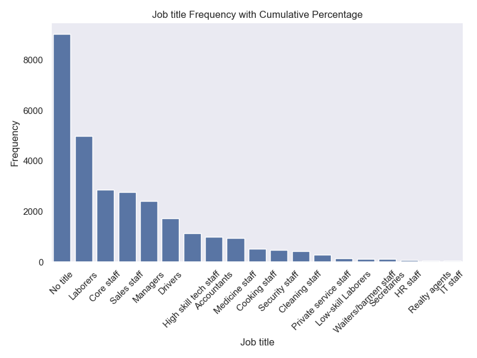
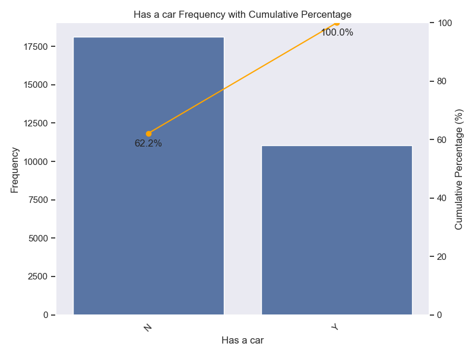
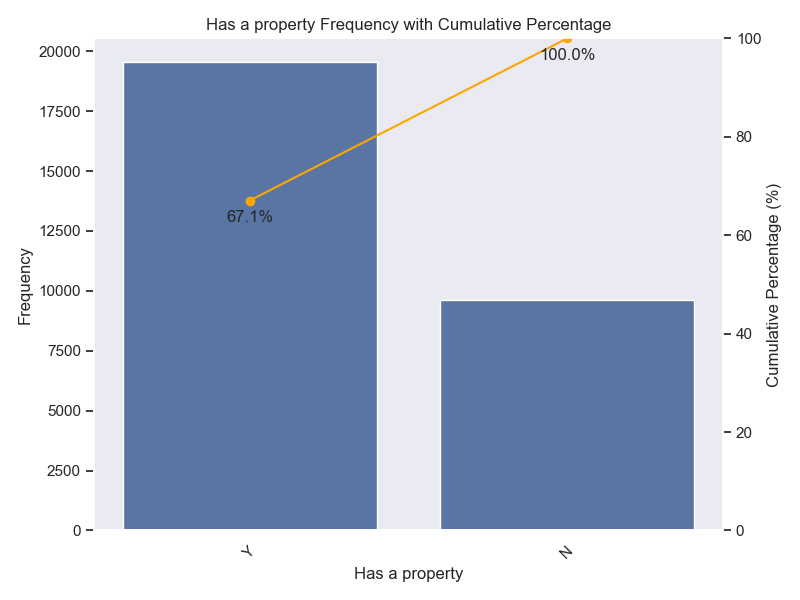
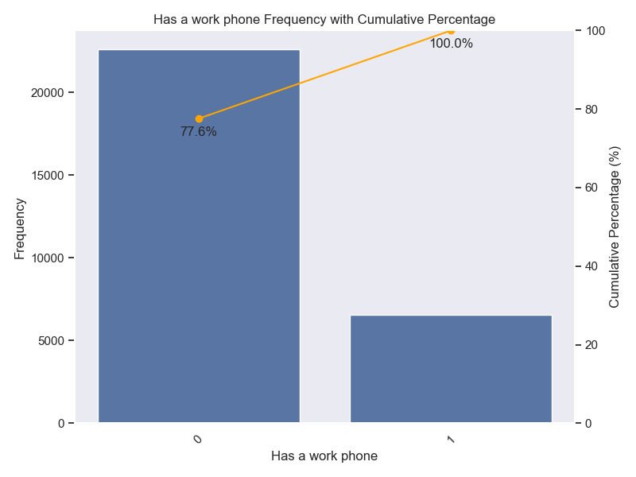
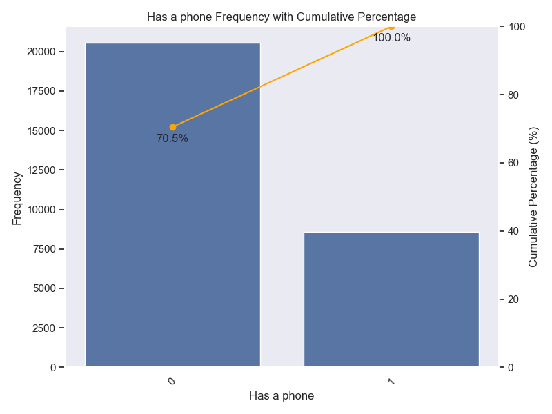
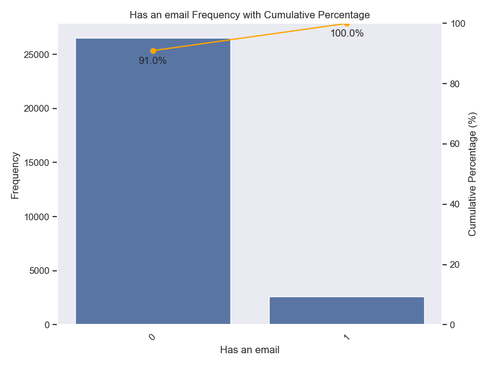

## Dados numéricos: distribuição

Antes de visualizar cada uma das colunas, vamos visualizar a matriz de correlação com o objetivo de identificar features que estão correlacionadas entre si

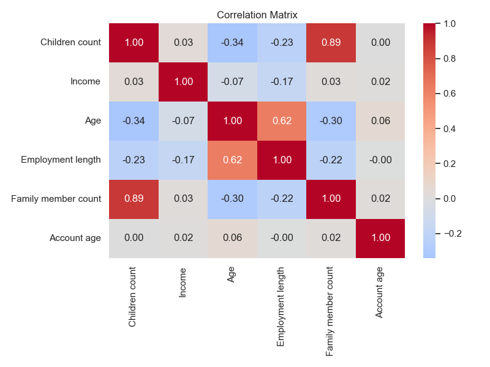

Vemos resultados importantes:

- `Family member count` e `Children count` apresentam uma grande correlação, justificada pela natureza das features.
- `Age` e `Employment length` também apresentam uma correlação considerável, mas que não necessariamente implicam uma na outra.
- `Age` e `Children count` também apresentam uma correlação.
- `Age` and `Family member count`.

Devido a multicolinearidade, vou remover a coluna `Children count` nesta analise, já que o `Family member count` já apresenta um bom indicativo.

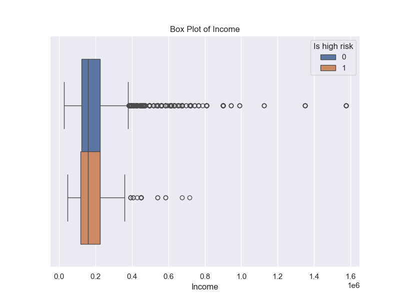
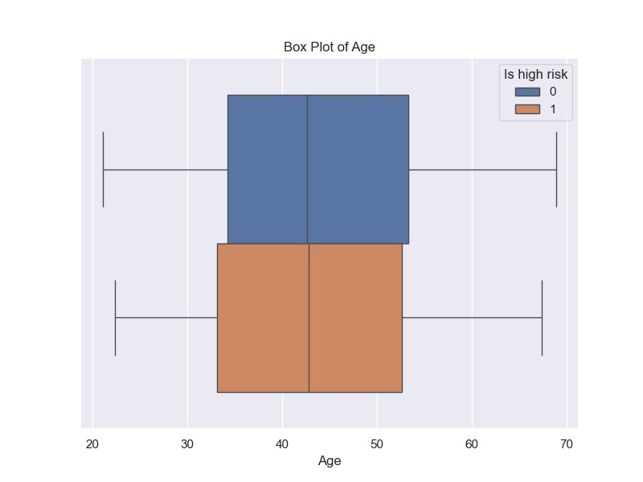

A feature `Employment length` possui um outliner claro: com valor maior que 1000 anos, esta entrada representa um dado errado/faltante. Portanto, este será removido da análise.

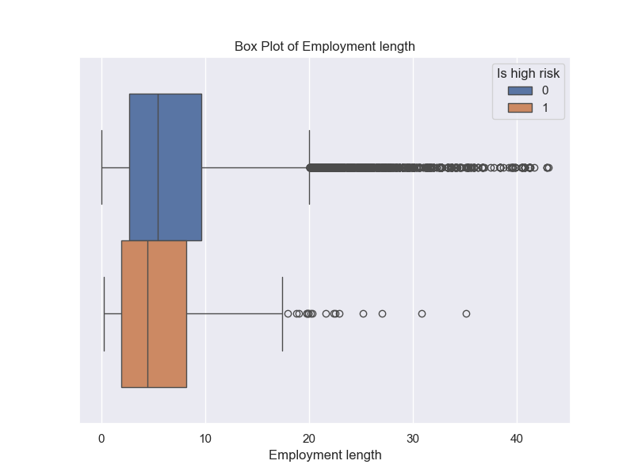
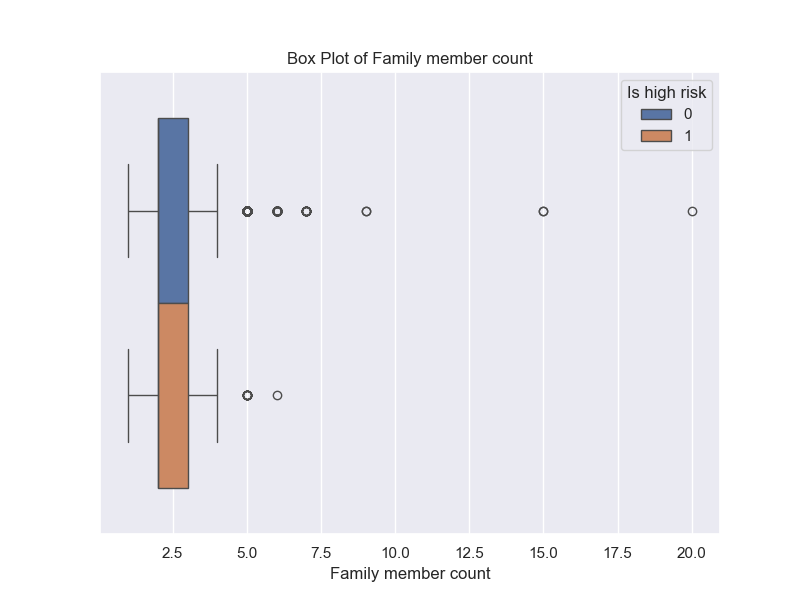
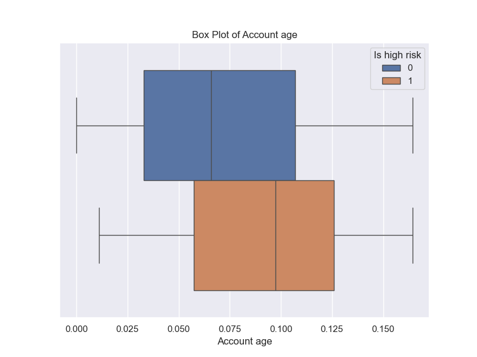

Da análise por meio dos diagramas de caixa, vemos que `Income`, `Employment length` e `Family member count` posui outliers naturais. Esses dados foram classificados e tratados como reais e possíveis de acontecer, representando variações socioeconomicas ao invés de entradas erradas.

## Coomentários

A análise preliminar sugere que nenhuma feature age como central na determinação da variável `Is high risk`. Portanto, seguimos com o dataset preparado para implementação de Machine Learning.
